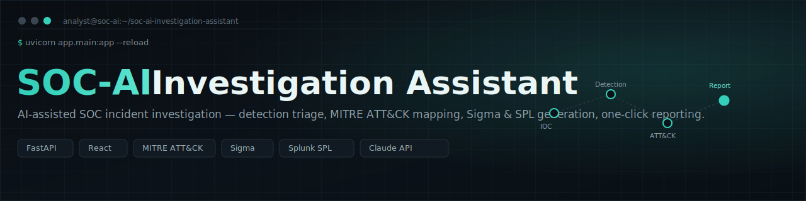
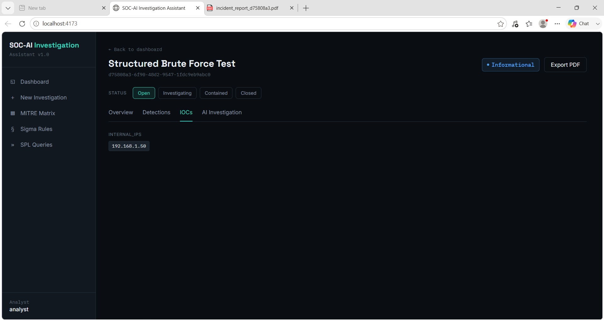
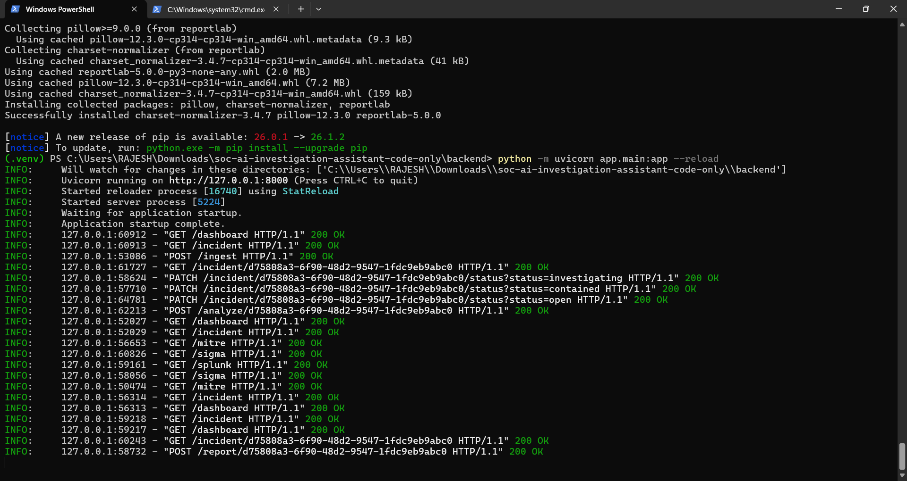

<div align="center">



<br/>


**An AI-assisted investigation console for SOC analysts — ingest detections, auto-map them to MITRE ATT&CK, generate Sigma & Splunk SPL, and let an LLM draft the root-cause narrative and the executive report.**

</div>

<br/>

## Overview

**SOC-AI Investigation Assistant** is a full-stack incident investigation platform built for security operations teams. An analyst ingests raw detections for an incident, and the platform takes over the repetitive parts of triage: it scores severity, extracts indicators of compromise, maps behavior to MITRE ATT&CK tactics and techniques, and hands the case to an AI investigator that produces a structured root-cause analysis, attack-chain narrative, and containment/remediation plan — all exportable as a client-ready PDF report.

It's designed to run **fully offline out of the box**. The AI module ships with a deterministic mock mode that mirrors the exact shape of the live LLM output, so the whole app is demo-able with zero API keys — and becomes a live, Claude-powered analyst the moment you add one.

<br/>

## ✨ Features

| Capability | Description |
|---|---|
| 🧩 **Detection ingestion** | POST raw detections into an incident and let the engine normalize, score, and store them. |
| 🎯 **Severity scoring** | Automatic 0–100 severity scoring per incident based on detection signal. |
| 🕸️ **MITRE ATT&CK mapping** | Detections are mapped to ATT&CK tactics & techniques and rendered on a live matrix view. |
| 🔎 **IOC extraction** | Pulls structured indicators (IPs, hashes, hosts, etc.) out of incident data automatically. |
| 🧠 **AI investigation** | LLM-generated summary, root-cause analysis, attack-chain narrative, and IOC explanation — powered by the Claude API, with a fully offline mock mode. |
| 🛡️ **Sigma rule library** | Auto-generates Sigma detection rules per detection type, viewable and copyable in-app. |
| 📊 **Splunk SPL generator** | Produces ready-to-run SPL hunting queries per detection type. |
| 🗓️ **Incident timeline** | Reconstructs a chronological event timeline for the incident. |
| 📄 **One-click PDF export** | Turns the full investigation into an executive-ready incident report. |
| 🔄 **Status workflow** | Track incidents through `Open → Investigating → Contained → Closed`. |

<br/>

## 📸 Screenshots

<table>
<tr>
<td width="50%">

**Dashboard — Incident & IOC view**


</td>
<td width="50%">

**FastAPI backend — live request log**


</td>
</tr>
<tr>
<td colspan="2">

**Exported executive incident report**


</td>
</tr>
</table>

<br/>

## 🏗️ Architecture & Tech Stack

```
┌────────────────────┐        REST / JSON         ┌──────────────────────────┐
│   React + Vite +   │  ───────────────────────▶ │   FastAPI backend         │
│   Tailwind CSS     │ ◀───────────────────────  │   (SQLAlchemy + SQLite)   │
│   frontend (5173)  │                            │   :8000                  │
└────────────────────┘                            └────────────┬─────────────┘
                                                                  │
                                                    ┌─────────────┴─────────────┐
                                                    │   AI Investigation Layer  │
                                                    │   Claude API (live mode)  │
                                                    │   Deterministic mock mode │
                                                    └───────────────────────────┘
```

**Backend** — FastAPI, SQLAlchemy, Pydantic Settings, `httpx`, ReportLab (PDF generation)
**Frontend** — React, Vite, Tailwind CSS
**AI** — Anthropic Claude API, with an offline deterministic fallback so the app never hard-depends on a key
**Storage** — SQLite by default (swap `DATABASE_URL` for Postgres/MySQL in production)

<br/>

## 🚀 Getting Started

### Prerequisites
- Python 3.11+
- Node.js 18+

### 1 · Backend
```bash
cd backend
python -m venv .venv
.venv\Scripts\activate        # Windows
pip install fastapi uvicorn sqlalchemy pydantic-settings httpx reportlab pillow
python -m uvicorn app.main:app --reload
```
Runs at **http://127.0.0.1:8000** (docs at `/docs`).

### 2 · Frontend
```bash
cd frontend
npm install
npm run dev
```
Runs at **http://localhost:5173**.

### 3 · Environment variables
Create `backend/.env`:
```env
DATABASE_URL=sqlite:///./soc_ai.db
SECRET_KEY=change-me-in-production
ANTHROPIC_API_KEY=            # optional — leave empty to run in offline mock mode
ANTHROPIC_MODEL=claude-sonnet-4-6
CORS_ORIGINS=["http://localhost:5173"]
```
> Leave `ANTHROPIC_API_KEY` empty and the AI Investigation module runs in **mock mode**, generating the same structured output deterministically so the app is fully demo-able offline.

<br/>

## 🔌 API Reference

| Method | Endpoint | Description |
|---|---|---|
| `POST` | `/ingest` | Ingest raw detections and create/update an incident |
| `POST` | `/analyze/{incident_id}` | Run the AI investigation for an incident |
| `GET` | `/dashboard` | Aggregate dashboard statistics |
| `GET` | `/incident` | List all incidents |
| `GET` | `/incident/{incident_id}` | Get a single incident |
| `PATCH` | `/incident/{incident_id}/status` | Update incident status |
| `DELETE` | `/incident/{incident_id}` | Delete an incident |
| `GET` | `/ioc/{incident_id}` | Get extracted IOCs for an incident |
| `GET` | `/mitre` | Get the MITRE ATT&CK matrix |
| `GET` | `/sigma` / `/sigma/{detection_type}` | List / generate Sigma rules |
| `GET` | `/splunk` / `/splunk/{detection_type}` | List / generate SPL queries |
| `GET` | `/timeline/{incident_id}` | Get the reconstructed incident timeline |
| `POST` | `/report/{incident_id}` | Export the executive PDF report |

<br/>

## 🗺️ Roadmap

- [ ] Multi-analyst authentication & role-based access
- [ ] Postgres-backed production deployment guide
- [ ] Real-time detection ingestion via webhook/SIEM connector
- [ ] Configurable Sigma/SPL rule packs

<br/>

## 📜 License

Licensed under the [MIT License](LICENSE).

<div align="center">
<sub>Built as a portfolio project — SOC-AI Investigation Assistant</sub>
</div>
